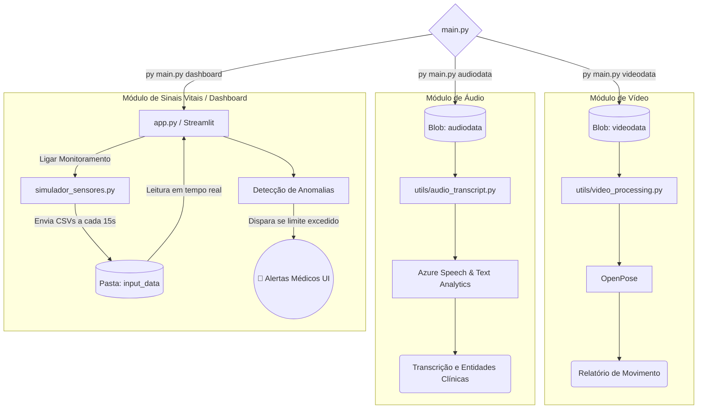

# tech_c_fase4_fiap

```mermaid
graph TD
    %% Nós principais
    A{main.py}

    %% Subgráficos para organizar por Módulos
    subgraph Módulo de Vídeo
        V_BLOB[(Blob: videodata)]
        V_PROC[utils/video_processing.py]
        V_MODEL[OpenPose]
        V_OUT(Relatório de Movimento)
    end

    subgraph Módulo de Áudio
        A_BLOB[(Blob: audiodata)]
        A_PROC[utils/audio_transcript.py]
        A_API[Azure Speech & Text Analytics]
        A_OUT(Transcrição e Entidades Clínicas)
    end

    subgraph Módulo de Sinais Vitais / Dashboard
        S_SIM[simulador_sensores.py]
        S_DIR[(Pasta: input_data)]
        S_APP[app.py / Streamlit]
        S_RULES[Detecção de Anomalias]
        S_ALERT((🚨 Alertas Médicos UI))
    end

    %% Fluxos do main.py
    A -- "py main.py videodata" --> V_BLOB
    V_BLOB --> V_PROC
    V_PROC --> V_MODEL
    V_MODEL --> V_OUT

    A -- "py main.py audiodata" --> A_BLOB
    A_BLOB --> A_PROC
    A_PROC --> A_API
    A_API --> A_OUT

    A -- "py main.py dashboard" --> S_APP
    
    %% Fluxo interno do Dashboard
    S_APP -- Ligar Monitoramento --> S_SIM
    S_SIM -- Envia CSVs a cada 15s --> S_DIR
    S_DIR -- Leitura em tempo real --> S_APP
    S_APP --> S_RULES
    S_RULES -- Dispara se limite excedido --> S_ALERT
```
