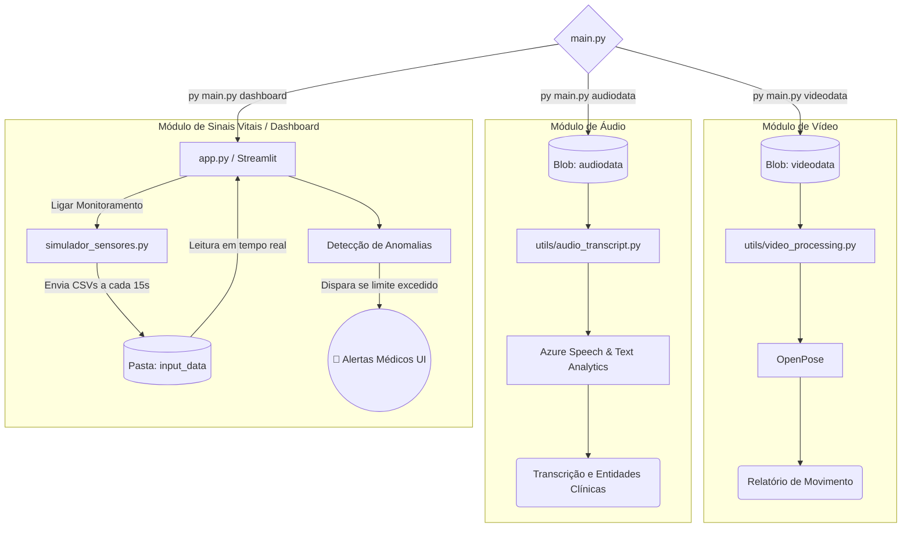

# Tech Challenge - Fase 4: Monitoramento Clínico Multimodal com IA e Azure

Este repositório contém o projeto da Fase 4 do Tech Challenge (Pós-Tech IA para Devs). O objetivo desta etapa é evoluir a instituição médica através da implementação de um sistema de monitoramento contínuo de pacientes, utilizando dados multimodais (áudio, vídeo e texto) processados em nuvem para identificar sinais precoces de risco.

## 📺 Demonstração do Projeto
* **Link para o YouTube:** https://youtu.be/vaTYJYOCD7A
* **Apresentação:** Demonstração prática do processamento multimodal, incluindo análise de postura em vídeo, transcrição e detecção de sentimentos em áudios, além do monitoramento e alerta de anomalias em sinais vitais via dashboard.

## 🛠️ Arquitetura do projeto
O ecossistema foi desenhado para ingestão, processamento e visualização de dados médicos em tempo real, integrando serviços gerenciados e modelos de visão computacional.

* **Integração em Nuvem (Azure):** Utilização do Azure Blob Storage para armazenamento e consumo dos arquivos multimídia, além do Azure Cognitive Services (Speech e Text Analytics) para processamento de linguagem natural.
* **Visão Computacional:** Pipeline construído com OpenCV e MediaPipe para a extração de marcos anatômicos e avaliação postural em vídeos clínicos.
* **Camada de Streaming e Monitoramento:** Criação de um ambiente de simulação em tempo real para leitura de sinais vitais, com interface de visualização analítica desenvolvida em Streamlit.
  



## 📋 Sobre a Evolução (Fase 4)

O foco desta fase foi a fusão de diferentes tipos de dados não estruturados e temporais para apoiar decisões clínicas, estruturada em três frentes principais:

### 1. Análise de Vídeo
Processamento de vídeos de cirurgias ou sessões de fisioterapia:
* **Análise Postural:** Aplicação do modelo MediaPipe para mapear os ombros e pulsos dos pacientes frame a frame.
* **Geração de Alertas:** Lógica condicional que detecta falhas (mãos abaixo da linha dos ombros) e gera relatórios físicos automáticos detalhando as infrações e os segundos de ocorrência.

### 2. Análise de Áudio
Processamento de gravações de voz em consultas para detectar indícios médicos:
* **Transcrição Assíncrona:** Uso do Azure Speech to Text para converter áudios `.wav` em texto longo e contínuo.
* **Análise de Sentimento:** Integração com Azure Text Analytics processando as transcrições em lotes para identificar padrões de sentimentos fortes (positivos ou negativos) com seus respectivos graus de confiança.

### 3. Detecção de Anomalias (Sinais Vitais)
Monitoramento constante da evolução clínica do paciente durante a internação:
* **Simulação de Fluxo de Dados:** Script dedicado para mover arquivos CSV gerando um fluxo de dados contínuo (streaming) similar a sensores de UTI.
* **Dashboard em Tempo Real:** Interface que avalia criticidade de Saturação de O2, Frequência Cardíaca e Temperatura, disparando *toasts* de emergência (🚨) imediatamente ao detectar riscos na saúde do paciente monitorado.

---

## 📊 Resultados Obtidos e Exemplos de Anomalias
### Análise Postural em Vídeo <br>
O sistema rastreia protocolos cirúrgicos/fisioterápicos e documenta automaticamente as violações posturais (mãos caindo abaixo da linha dos ombros).

```
=== RELATÓRIO DE POSTURA: sample_video1.mp4 ===
Total de frames: 5249
Total de falhas: 8

[FALHA] As mãos caíram abaixo da linha dos ombros no segundo 40.17 (Frame 1205)
[FALHA] As mãos caíram abaixo da linha dos ombros no segundo 61.37 (Frame 1841)
[FALHA] As mãos caíram abaixo da linha dos ombros no segundo 74.37 (Frame 2231)
[FALHA] As mãos caíram abaixo da linha dos ombros no segundo 88.97 (Frame 2669)
...
```
### Transcrição de Áudio e Análise de Sentimento
A transcrição médica é processada para classificar a polaridade e confiança do discurso, permitindo identificar possíveis queixas severas ou evoluções positivas no relato.

```
[POSITIVE] And you are new to me, correct? Perfect. Tell me what brings you to see me.
Pos: 0.88 | Neu: 0.12 | Neg: 0.00

[NEGATIVE] The main issue with that is that it's very hard to get a bump that big out of a tiny hole, so you often end up having to make a line.
Pos: 0.00 | Neu: 0.00 | Neg: 1.00

[NEGATIVE] Since it is bothersome, I can't type.
Pos: 0.00 | Neu: 0.15 | Neg: 0.85
```

### Monitoramento de Sinais Vitais
O fluxo simulado reflete medições segundo a segundo. Conforme demonstrado no painel interativo (veja a referência image_ee34e0.png), o sistema acusa anomalias instantaneamente na UI, tais como:

Paciente 18: Alerta de Temperatura Crítica (33.4 °C).

Paciente 5: Alerta de Saturação de O2 Anormal (94%).

Demais pacientes: Monitoramento contínuo em status verde (✅ Normal).


## 📂 Estrutura do Projeto

```text
/
├── main.py                          # Ponto de entrada do sistema que lê o Azure Blob Storage e roteia as tarefas
├── utils/                           # Módulos de processamento especializados
│   ├── app.py                       # Interface Streamlit para o Dashboard de UTI
│   ├── video_processing.py          # Script de Visão Computacional (OpenCV + MediaPipe)
│   ├── audio_transcript.py          # Script de serviços cognitivos (Azure Speech e Text Analytics)
│   ├── simulate_streaming_data.py   # Gerador de eventos de simulação de sensores
│   └── data_streaming_processing.py # Script de monitoramento de CSVs (IsolationForest / Regras)
├── raw_data/                        # Diretório de origem com os CSVs de sensores brutos (input do simulador)
├── input_data/                      # Diretório de destino consumido pelo Streamlit em tempo real
├── samples/                         # Pasta temporária para download de vídeos e mídias do Azure
├── reports/                         # Relatórios txt exportados com os resultados das análises posturais
├── output_processing_video/         # Vídeos renderizados com as anotações visuais do MediaPipe
└── requirements.txt                 # Lista de dependências e bibliotecas do projeto
```

## 🚀 Guia de Execução

Pré-requisitos
* Ambiente Python configurado e dependências instaladas (pip install -r requirements.txt).
* Arquivo .env na raiz do projeto configurado com as chaves de acesso: AZURE_STORAGE_CONNECTION_STRING, AZURE_SPEECH_KEY, AZURE_SPEECH_REGION, AZURE_TEXT_ANALYTICS_ENDPOINT e AZURE_TEXT_ANALYTICS_KEY.

Passo 1:Processamento de Dados Multimodais (Mídia)
1) Para processar vídeos armazenados no Blob Storage, execute: python main.py videodata [nome_do_arquivo.mp4]
2) Para processar áudios e gerar transcrições via Azure, execute: python main.py audiodata [nome_do_arquivo.wav] 

Passo 2: Monitoramento Contínuo e Dashboard de Anomalias
1) No terminal, inicie o dashboard do Streamlit com o comando nativo do orquestrador:python main.py dash
2) Na interface web aberta, clique em "Ligar Monitoramento Automático" para acionar o simulador em segundo plano.
3) Garanta que existam arquivos .csv na pasta raw_data/ para visualizar o processamento contínuo e a emissão de alertas clínicos na tela do sistema.


## ✒️ Autor - Kevin Makoto Shiroma
Projeto desenvolvido como parte da avaliação do **Tech Challenge - Fase 4**.

